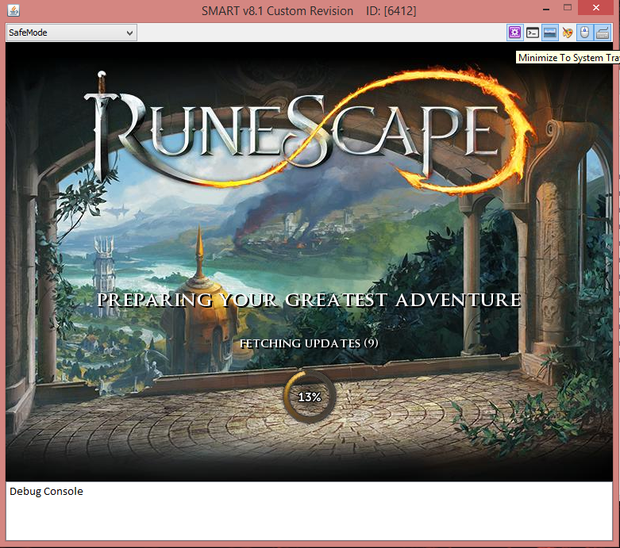
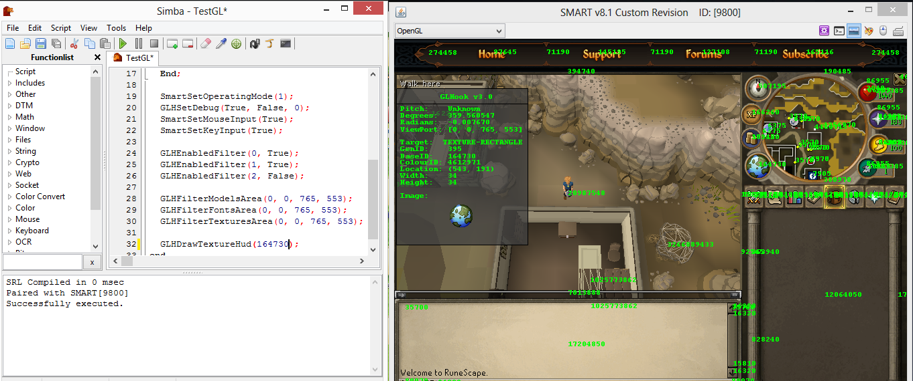
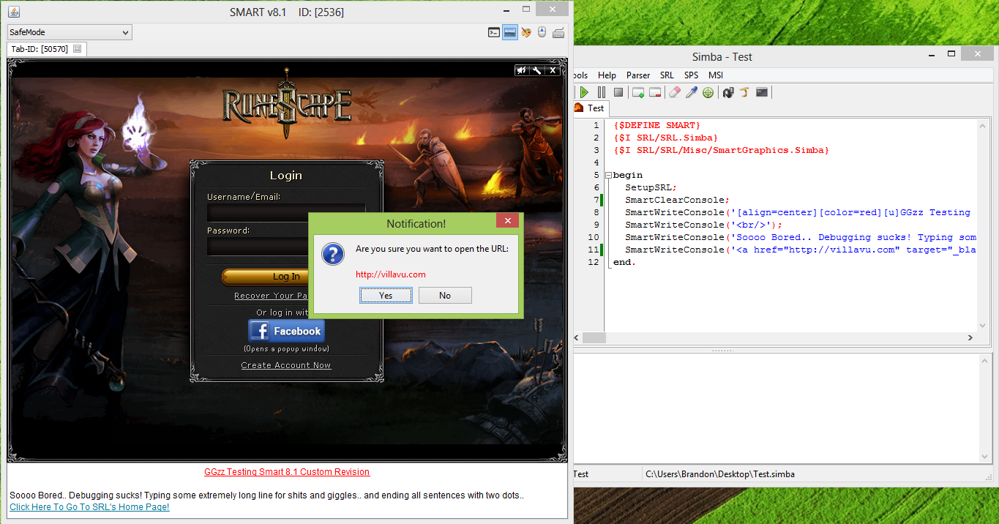

SMART
===

About SMART:
------------

SMART was created by BenLand100 (~Benjamin J. Land) a very long time ago. It is currently hosted
on github at https://github.com/BenLand100/SMART

SMART (v5.0+) is released under the GPLv3.
About SMART: http://bland.no-ip.org/index.php?title=SMART

Modifications:
--------------

This version of SMART was modified to add features such as:

- Multiple Tabs
- A command-line console
- Screenshots
- Mouse and Keyboard enabling/disabling
- Minimize to tray

and to fix bugs with socket connections. It is a mixture of Acid-loader and SMART in one.

